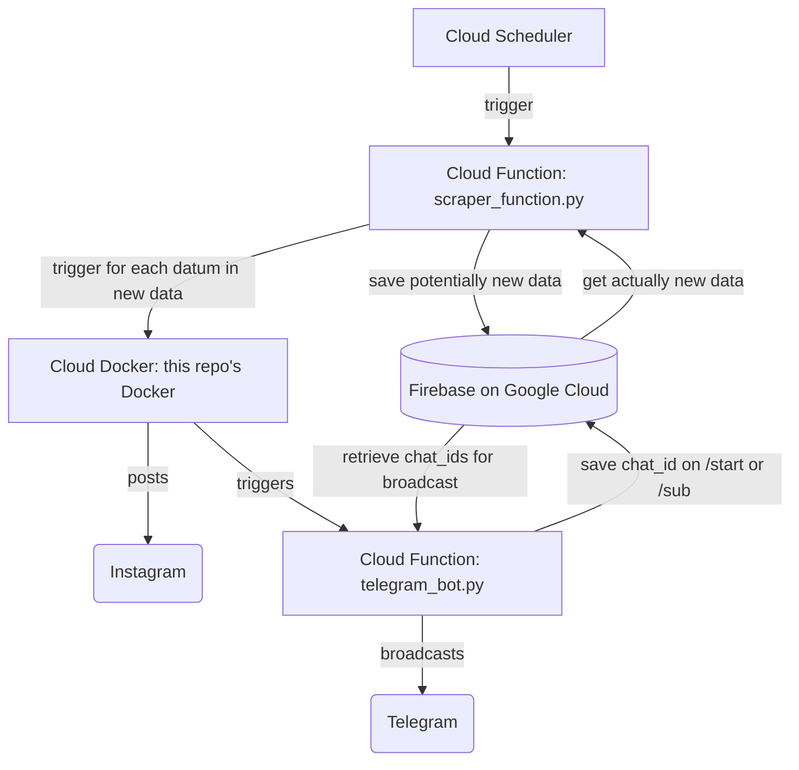

# What is the German Bundestag (national parliament of the Federal Republic of Germany) up to? (Was treibt der Bundestag?)

This repo contains all necessary code to set up an autonomous bot that scrapes
the [Bundestag committee's page](https://www.bundestag.de/ausschuesse) for PDFs,
analyzes these using <i>gpt-4</i> and automatically posts their relevant content on
[Instagram @was_treibt_der_bundestag](https://www.instagram.com/was_treibt_der_bundestag/).
For more information about the deployment, see section Usage.

Telegram bot: [t.me/was_treibt_der_bundestag_bot](https://t.me/was_treibt_der_bundestag_bot) [Not properly implemented yet]
Website: [wastreibtderbundestag.X](https://www.wastreibtderbundestag.X) [Not properly implemented yet]

Main contributors: Lorenz Hufe [@lowrenz](https://github.com/lowlorenz), Justus Westerhoff [@MassEast](https://github.com/MassEast), Jakob Maleck
Affiliation: [BLISS Berlin](https://bliss.berlin/)

## Why?

As of March 2024, the German Bundestag's committees regularly [publish](https://www.bundestag.de/ausschuesse) their work, plans and activities in the form of PDF files. We think that the committe's work isn't transparent and 'shareable' enough and hence thought
of a simple solution to make it more accessible. Especially, we wanted to
point out which proposals the different parties bring up to clearly see
what they are dealing with. Examples:
- 13.03.2024, Antrag der AfD: "Kinderkopftuch als politisch-weltanschauliches Symbol - Verbot in öffentlichen Kindertageseinrichtungen und Schulen" (in English: AfD motion: "Children's headscarves as a political and ideological symbol - ban in public kindergartens and schools")

## Usage

We currently deployed it on Google Cloud in the following way:

### .env
Your .env file should contain a backend URL that runs the docker ("BACKEND_URL"), an OpenAI key ("OPENAI_API_KEY"), an Instagram username ("INSTAGRAM_USERNAME") and password ("INSTAGRAM_PASSWORD"). If a Telegram bot wants to be used as well, also provide a Telegram bot token ("TELEGRAM_BOT_TOKEN").

## Remarks

Without [instragrapi](https://github.com/subzeroid/instagrapi) this probably wouldn't have been so easy, since using Meta's actual Instagram API turned out to be very restrictive (need for Business account and much more). [Meaning: We could not figure it out in one night, the night where this project was drafted and implemented.]

At the [Berlin Hack & Tell #99](https://bhnt.c-base.org/2024-09-24-no99-reasoning-hacks), we were made aware of the [Bundestagszusammenfasser](https://bundestagszusammenfasser.de/), which does similar thing, but not as focused as producing specialized social media posts, but rather structuring (and also summarizing) very nicely almost everything that can be found on German state websites. Take a look at Sabrina's website!

## Potential improvements
- become independent from OpenAI and use a self-hosted, opensource LLM instead
- use multi-prompts/multi-agents, e.g., through LangChain, to achieve a better and more reliable information retrieval from the PDF files (the currently used prompt is already kind of large and may easily be subgoaled)
- check if found titles by the LLM actually appear in the document to be somewhat certain that it is not making stuff up
- use better text extraction from the PDF, e.g., by better taking into account the actual PDF structure (notice that there are out-of-the-box solutions to achieve this with `pdfplumber` and also `pypdf`, but we did not find an easy way to combine these with highlighting bold text as well (which we thought of as more important than the PDF's structure))
- follow [instagrapi's best practices](https://subzeroid.github.io/instagrapi/usage-guide/best-practices.html) because we may easily (update: we did!) overshoot the mentioned safe limit of 4-16 posts and should hence use a proxy, session saving or delays between requests, as outlined on the page
